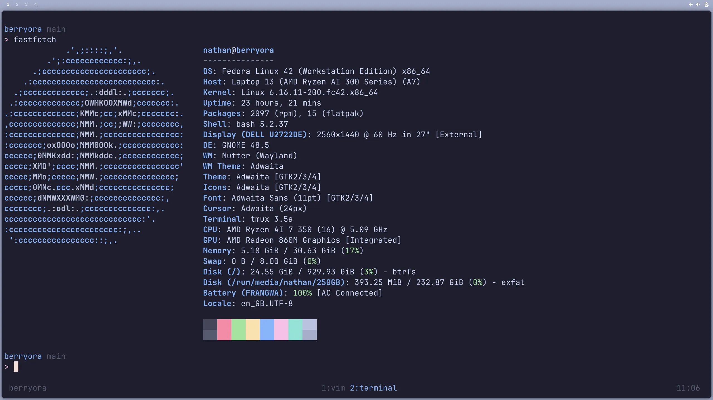

# berryora

> An Fedora Linux System Tool that automates the setup and configuration of an
> Fedora system with Gnome.
> It installs and configures packages, desktop environments, and various utilities
> to create a fully functional development environment.

## Preview



## Features

- Automated system updates
- Packages installations
- GNOME desktop environment setup with tiling-like features
- Flatpak integration for specific applications
- Automatic service configuration
- GNOME extensions and hotkey configuration

## Prerequisites

- A fresh installation of Fedora Linux
- Internet connection
- sudo privileges

## Installation

1. Clone this repository:

```bash
git clone https://github.com/nathanberry97/berryora.git
```

2. Run the setup script:

```bash
./main.sh
```

3. The script will handle the rest of the setup process.

4. After the setup is complete, you can reboot your system to see the changes.

## Get current extension configuration

`dconf dump /org/gnome/shell/extensions/`
